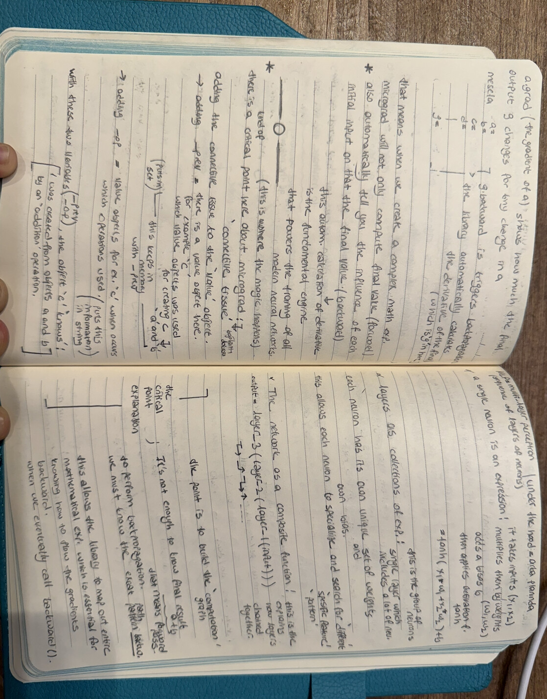

# 🚀 AI Development Log: Building Neural Networks

Welcome to my  intensive journey into the mathematical foundations of Artificial Intelligence. As a Software Engineering student transitioning from **Washington D.C.** to **Los Angeles**, I am deep-diving into the core of **Neural Networks** and **LLM Foundations (Stanford CS336)**.

## Day 1: The Heart of Autograd & Backpropagation

Today’s focus was on understanding the "connective tissue" of modern deep learning libraries like PyTorch. I implemented a lightweight scalar autograd engine (inspired by Micrograd).

### 🧠 Theoretical Foundations (Handwritten Notes)
I believe that to build the future of AI, one must master the math behind it. Below are my study notes on the computation graph, the chain rule, and Multi-Layer Perceptrons:

### 🛠️ Implementation Highlights
- **Value Class:** A custom object that stores data and its gradient.
- **Computation Graph:** Built using `_prev` and `_op` to track history.
- **Backpropagation:** Implemented the `backward()` function to automate the chain rule.
- **Activation Functions:** Integrated `tanh` for non-linearity as seen in my notes on neurons.

---
*Stay tuned for other days, where I will extend this engine to build a full Neuron and Layer structure.*