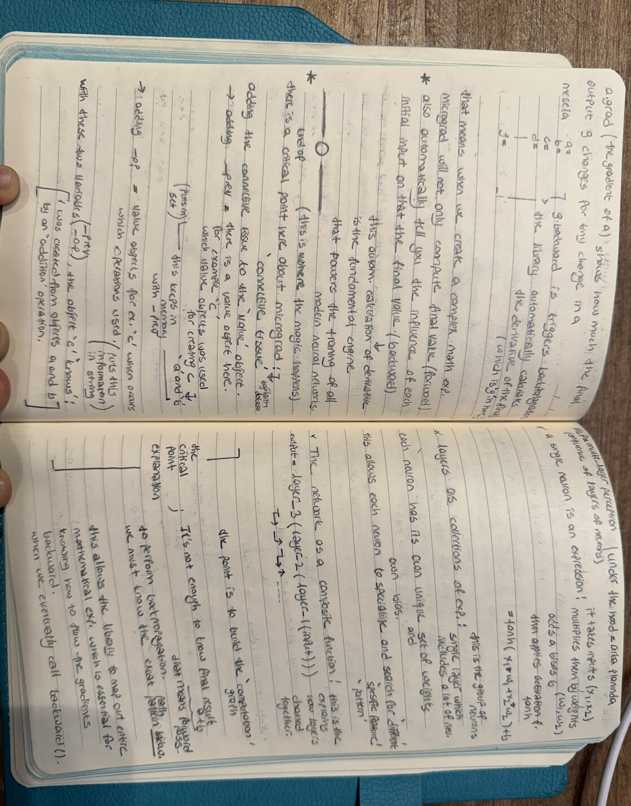

# Day 1: The Heart of Autograd & Backpropagation

This is where the repository starts. On Day 1 I built the connective tissue of every deep
learning library — a scalar autograd engine — so that I understand backpropagation from the
ground up, not as a black box.

## My Notes

My handwritten study of the computation graph, the chain rule, and the Multi-Layer Perceptron.

## What I Built
I implemented a lightweight scalar autograd engine, inspired by Andrej Karpathy's micrograd:
- **Value class:** a custom object that stores a scalar, its gradient, and the operation that produced it.
- **Computation graph:** built with `_prev` and `_op`, so every value remembers its own history.
- **Backpropagation:** I wrote `backward()` to apply the chain rule automatically, in reverse topological order.
- **Activation:** I added `tanh` for non-linearity, exactly as in my notes on a single neuron.

## The Six Ideas This Makes Concrete
1. A derivative is the slope of a function at a point — how much the output moves when I nudge the input.
2. Every operation (add, mul, tanh) has a simple local gradient rule.
3. The chain rule connects those local rules from the output all the way back to the inputs.
4. Topological sort guarantees the backward order is correct — children before parents, reversed.
5. A neural network is just one big mathematical expression; the loss is the scalar I differentiate.
6. Gradient descent is `weight -= lr * weight.grad`, repeated until the loss is small.

## Manual Backprop (Backprop Ninja)
In `manual_backprop_ninja.py` I differentiate a full MLP by hand — every gradient
(`dlogprobs`, `dprobs`, `dcounts`, ...) written out step by step — to prove I can do
what `Value.backward()` does automatically. This is the exercise that made backprop click for me.

## Files
| File | What it is |
|------|-----------|
| `micrograd_lite.py` | My original scalar autograd engine (study copy) |
| `micrograd_litec.py` | Refactored version — cleaner ops, `__repr__`, `math.tanh` |
| `karpathy_nn_foundation.py` | Reference distilled from Karpathy's micrograd lecture |
| `manual_backprop_ninja.py` | Manual backprop of a full MLP, written out by hand |

## Why It Starts Here
Everything else in this repo — bigram models, batch normalization, RNNs — is an extension
of what `Value.backward()` does in about 15 lines. I wanted that foundation to be mine
before moving on.

---
*Code and pedagogy for micrograd: Andrej Karpathy — [Neural Networks: Zero to Hero](https://github.com/karpathy/nn-zero-to-hero) (MIT License).*
