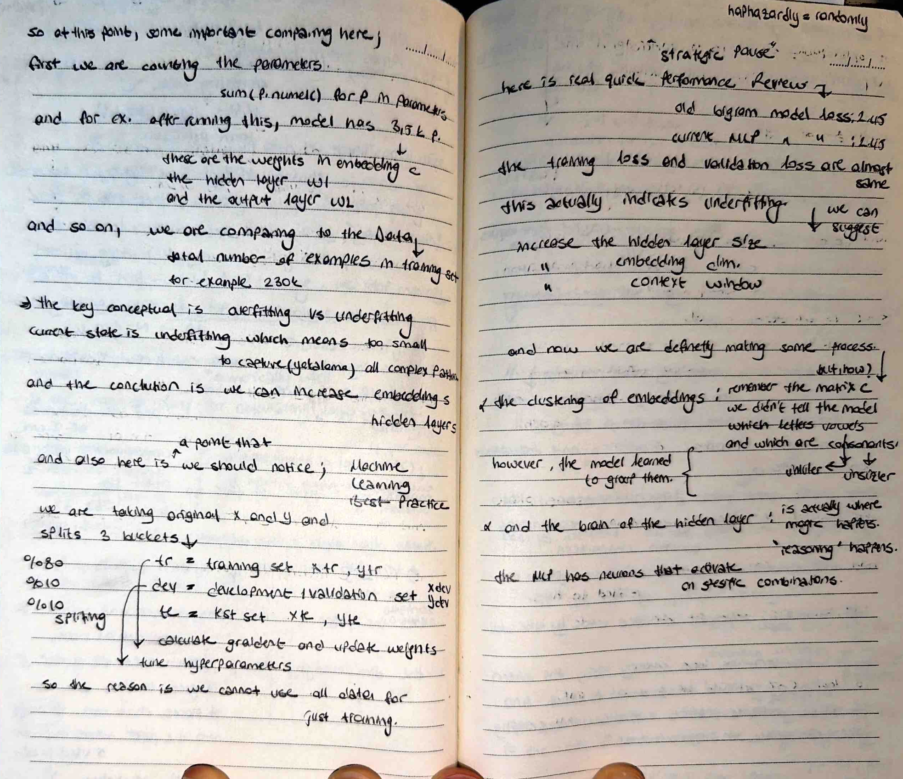
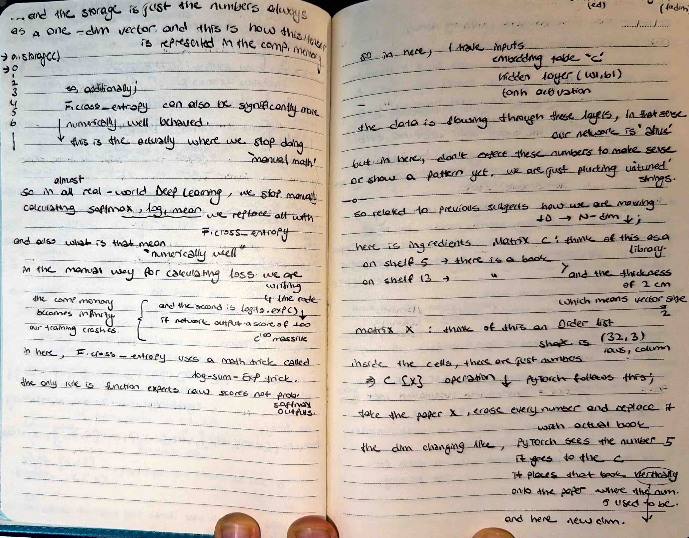

# 🧠 Machine Learning Best Practices - The 3 Buckets

Today, I shifted from building the Multi-Layer Perceptron (MLP) to analyzing its performance. I implemented a robust **Data Splitting** strategy and diagnosed a critical case of **Underfitting**.

## 📸 My Notes
 
 

## 🚀 The Three Buckets Strategy
I organized my data into three isolated sets to ensure the model generalizes well to new, unseen data:
- **Training Set (80%):** Used for backpropagation and updating weights.
- **Development/Validation Set (10%):** Used to tune hyperparameters like learning rate and layer size.
- **Test Set (10%):** Kept completely separate to measure final accuracy after training is finished.

## ⚡ Diagnosing Underfitting
My performance review showed that the current MLP loss matches the old Bigram model at **2.45**. This is a clear sign of **Underfitting**, meaning my model is too small to capture the complex patterns in the dataset. 
- **The Fix:** I will increase the size of the hidden layers and the embedding dimensions to give the model more "capacity".

## 🧠 Emergent Properties: The Brain of the MLP
Despite the underfitting, I documented something remarkable: **Clustering**. 
- Even without being told the difference, the model began to group vowels and consonants separately in the embedding space.
- This confirms that "reasoning" is beginning to happen within the hidden layer's neurons.