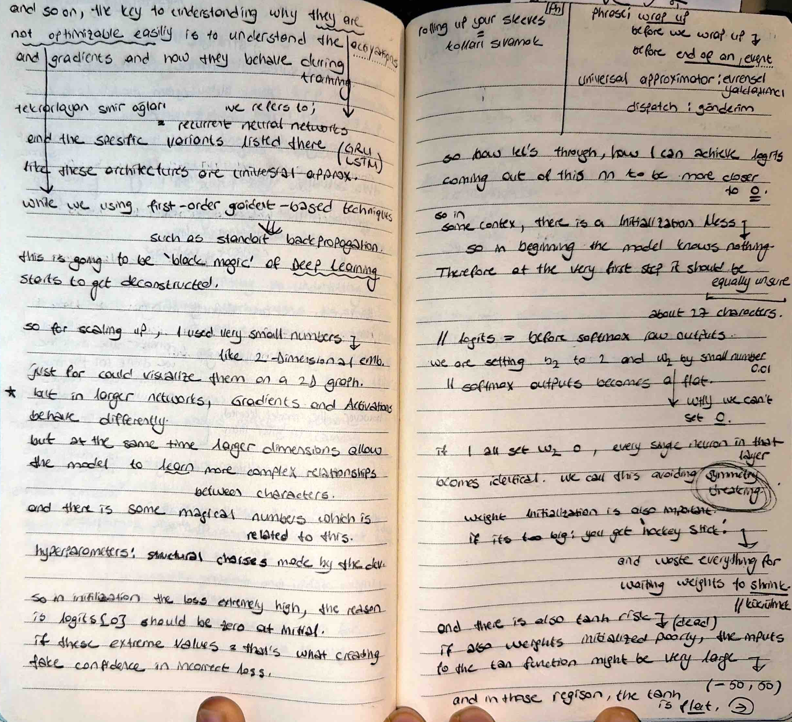

# 🧠 Initialization Mess & The Dead Tanh Problem

I have reached the final stage of my structural analysis. Today, I deconstructed the "Black Magic" of weight initialization and documented how poor starting values can destroy a model's ability to learn.

## 📸 My Notes

## 🚀 The Necessity of Symmetry Breaking
I realized that we cannot initialize weights to zero. If every neuron starts with the exact same weight, they will all calculate the same gradient and update in the exact same way—making the hidden layer redundant. We must use random values to "break symmetry".

## ⚡ The "Dead Tanh" Phenomenon
A major risk in Deep Learning is the **Dead Neuron**.
- **The Cause:** If weights are too large, the input to the `tanh` function ends up in the extreme regions (e.g., $-50$ or $50$).
- **The Result:** In these regions, the `tanh` curve is completely flat. Mathematically, the gradient becomes zero, and the neuron stops updating forever. It is effectively "dead".

## 📉 Avoiding the "Hockey Stick"
I documented the "Hockey Stick" loss curve, which occurs when a model starts with "fake confidence" due to poorly scaled weights. 
- **The Cost:** The model spends the first part of training just shrinking its weights to a reasonable size, wasting computational resources.
- **The Fix:** Initializing weights with a small scale (e.g., $W \times 0.01$) ensures the initial loss is low and the model starts learning immediately.
