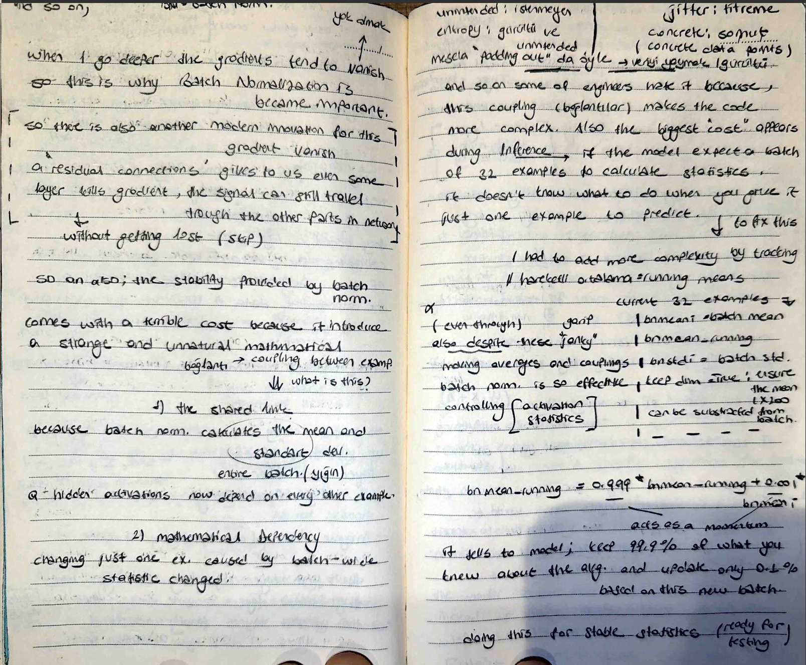

# Batch Normalization - The 2015 Google Innovation

## 📸 My Notes

I have reached the stage where I am no longer just building layers, but actively managing the distribution of data within my network. Today, I implemented Batch Normalization (BN) to force my hidden states into a stable, Gaussian-like distribution.

## ⚖️ Forcing the Gaussian Distribution
I documented that deep learning is extremely sensitive to the distribution of hidden states. If they are not roughly Gaussian, the non-linearity (like Tanh) won't work effectively. 
- **The Concept:** I am mathematically forcing every batch to have a mean ($\mu$) of 0 and a standard deviation ($\sigma$) of 1.
- **Gain & Bias:** To ensure the network doesn't lose flexibility, I implemented two learnable parameters: **Gamma ($\gamma$)** for gain and **Beta ($\beta$)** for bias. This allows the model to "undo" the normalization if it finds a better distribution.

## 🧪 The "Unnatural Coupling" Problem
I realized that BN comes with a "terrible cost". 
- **The Shared Link:** Because BN calculates statistics across an entire batch, individual examples become mathematically dependent on every other example in that batch. 
- **The Jitter:** I documented this as "entropy" or "jitter". While this coupling makes the code more complex, it acts as a form of unintended regularization that stabilizes training.

## 🛰️ Solving the Inference Paradox
I identified a major problem: During inference, I might only have **one** example to predict, making it impossible to calculate batch statistics. 
- **The Solution:** I implemented **Running Mean** and **Running Variance**. 
- **Momentum:** I am using a momentum of **0.999**. My model keeps track of 99.9% of what it previously knew about the global distribution and updates only 0.1% based on the current batch. This ensures the model is always "ready for testing".
