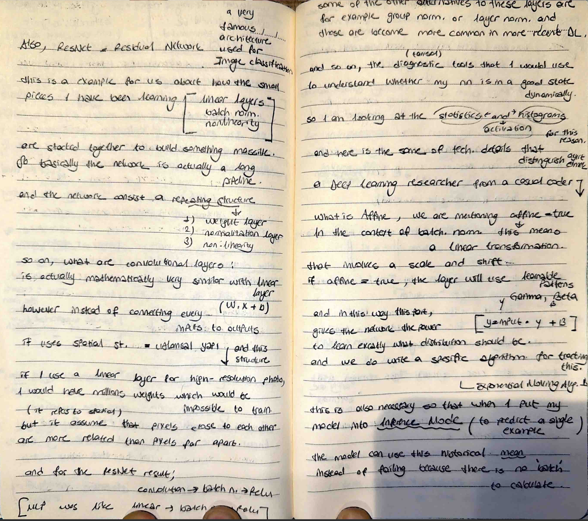

# The Dashboard & The Great Bug Hunt

## 📸 My Notes

Today marks my transition from "building the engine" to "tuning the dashboard." I have implemented structural diagnostics to ensure my model doesn't just run, but learns optimally.
## 📈 The Update-to-Data Ratio
I implemented a crucial metric to monitor learning health. This ratio tells me how big of a step I am taking compared to the scale of my weights.
- **The Formula:** $$ratio = \frac{std(learning\_rate \cdot gradient)}{std(data)}$$
- **The Golden Rule:** I documented that this ratio should be around **1e-3 (0.001)**. If it's too high, the updates are too aggressive; if too low, the model is barely learning.

## 🚀 Corrected Architectural Mistakes
I followed a "Gold Standard" checklist to eliminate common production bugs:
1. **Zero-Grad:** Ensured `optimizer.zero_grad()` is called every loop.
2. **Train/Eval Toggle:** Managing Batch Norm buffers with `model.train()` and `model.eval()`.
3. **Logits Check:** Confirmed `F.cross_entropy` receives raw Logits, not Softmax.

# Additionally; 
# Entering the World of RNNs

I am moving beyond fixed-size inputs. Today, I began documenting why standard Feed-Forward networks fail at processing sequences and how Recurrent Neural Networks (RNN) solve this through 'memory'.

## The Shift in Paradigm
- **Standard NN:** Processes data points in isolation.
- **RNN:** Processes a sequence of data, where the output of the previous step becomes an input for the current step.

## Concept: The Hidden State
I am learning to implement a 'hidden state' ($h_t$) that acts as the model's memory, allowing it to understand context in text or time-series data.