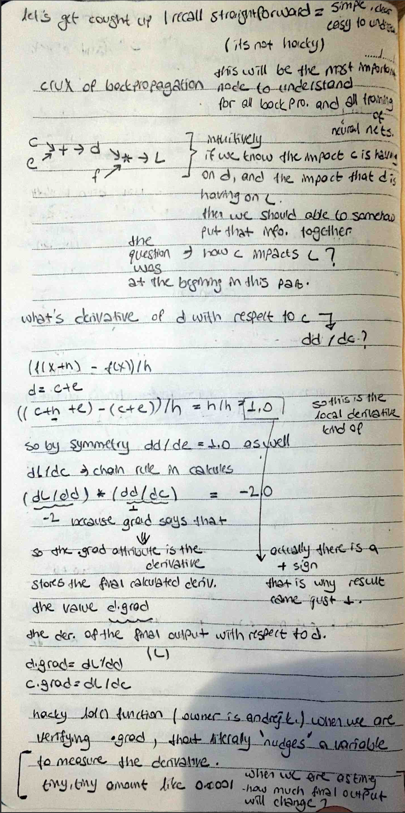

# 🧠 Neural Network Deep Dive: Continuous Implementation Log

This repository tracks my journey from basic autograd engines to complex architectures. 
Currently transitioning from **Washington D.C.** to **Los Angeles**, focusing on **LLM Foundations** and **Neural Net internals**.

### 📸 My Study Notes

## Day 2: The MLP Architecture & The Crux of Backpropagation

Today’s focus was the transition from scalar values to structured neurons and layers.

### 🧠 Theoretical Deep Dive
- **The Crux of Backprop:** Understanding how the impact of $c$ on $d$ and $d$ on $L$ allows us to find $dL/dc$ via the **Chain Rule**.
- **Non-Linearity:** Why we use `tanh` to squash outputs and allow the network to learn curved patterns instead of just straight lines.
- **Optimization Loop:** Implementing the 5-step process: Predict ➡️ Loss ➡️ Grad ➡️ Update ➡️ Repeat.

