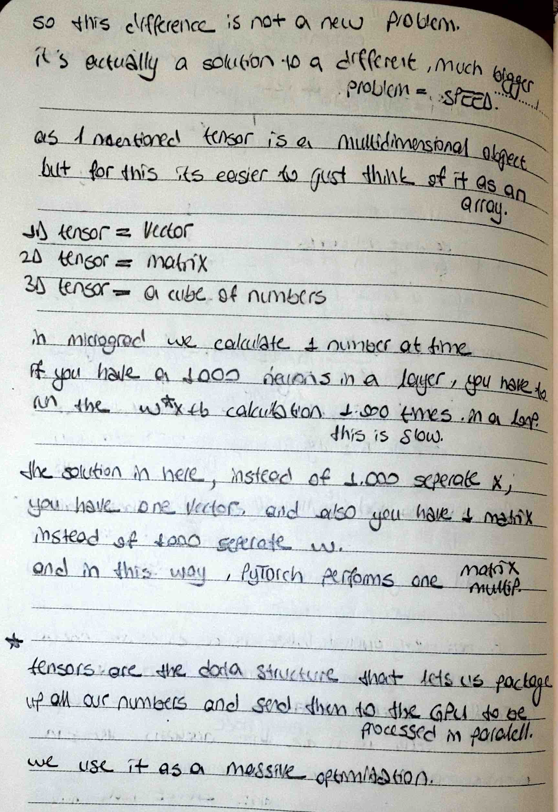
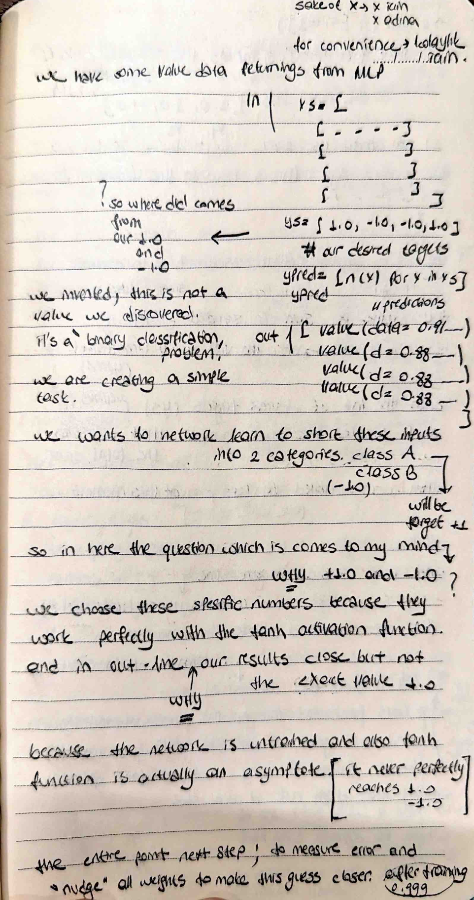

# 🧠 The Crux of Neural Network Optimization

I am continuing my deep dive into the mathematical core of AI. Today, I moved from individual components to implementing a full **Training Loop** and understanding why industry-standard tools like **PyTorch** rely on **Tensors**.

## 📸 My Technical Notes
these are again my handwritten study notes and I also to document the logic behind binary classification and the asymptote nature of the `tanh` function.

## 🚀 The 5-Step Optimization Cycle
Based on my analysis, I implemented the following cycle to train my network:
1. **Predict:** Running the forward pass to get the current "wild guess."
2. **Check Error:** Using a Loss Function (Mean Squared Error) to measure "how wrong" the model is.
3. **Find Gradients:** Triggering `backward()` to calculate gradients—my mathematical cheat sheet.
4. **Update Weights:** Nudging the parameters in the opposite direction of the gradient to minimize loss.
5. **Repeat:** Iterating until the predictions align with my targets.

## ⚡ Scalar (Micrograd) vs. Tensor (PyTorch)
I documented a critical realization today regarding performance:
- **Scalar Engine:** My current implementation processes one number at a time. This is a learning tool but is computationally slow for large networks.
- **Tensor Engine:** Tensors package numbers into multidimensional arrays, allowing for **Matrix Multiplication**. This enables parallel processing on the **GPU**, which is the single biggest difference between a learning tool and a production tool like PyTorch.
