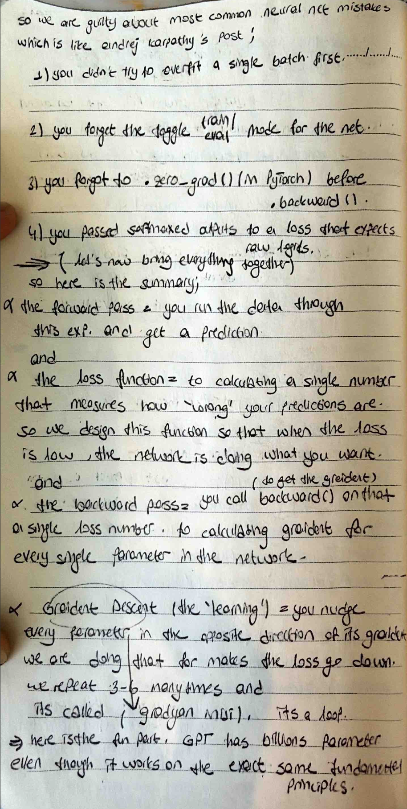
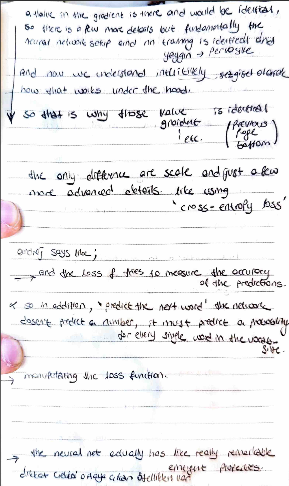

# 🧠 Modularization & The Gradient Descent Loop

I have taken my scalar engine and transformed it into a modular system. Today’s goal was to automate the collection of parameters and implement the full Gradient Descent loop.
# 📸 My Notes
 
 
## 🚀 Key Architectural Upgrades
- **Module Base Class:** I created a parent class to handle shared operations like `zero_grad()`.
- **Parameter Collection:** Instead of manually tracking weights, I implemented a `parameters()` helper function for Neurons, Layers, and the MLP. This returns a single flat list of every tunable value in the network.
- **Gradient Descent Loop:** I formalized the "Learning" as a repetitive process of nudging weights in the opposite direction of their gradients.

## 🧠 Theoretical Insights from My Notes
### The "Magic Line"
I documented the power of `loss.backward()`. This single command triggers a topological sort that ripples backward through the entire massive graph, calculating the exact impact of every single weight on the final error.

### Scaling to GPT
I realized that while my Micrograd-based network has a few dozen parameters, models like **GPT-4** have billions. Remarkably, they both operate on the exact same fundamental principle: the **Chain Rule** and **Gradient Descent**.

 

