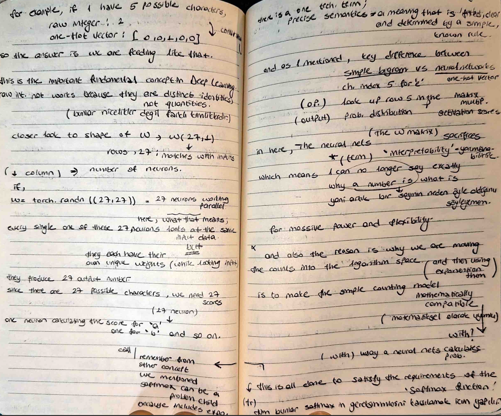

# 🧠 One-Hot Encoding & The Identity Principle

I am moving beyond simple counting tables and preparing my data for a full **Neural Network**. Today’s focus was understanding the mathematical necessity of **One-Hot Encoding** and why raw numerical representations of text lead to biased models.

## 📸 Study Notes
My notes today explain the transition from simple Bigrams to Neural Networks and the logic of vector representation.

## 🚀 Identities, Not Quantities
I documented a critical realization today: characters like 'a' and 'z' are distinct categories. 
- **The Failure of Raw Ints:** If we use index `1` for 'a' and `26` for 'z', the network's weights would scale `z` by a factor of 26 relative to `a`. This is mathematically incorrect for classification.
- **The One-Hot Fix:** By representing each character as a vector of size 27 (where only the character's index is `1`), we give every token a neutral and equal starting point.

## ⚡ The Shift to "Algorithm Space"
I am transforming my manual Bigram counts into a **differentiable equation**:
- **Matrix Multiplication:** Using One-Hot vectors allows us to perform $x @ W$, which effectively "looks up" a row in our weight matrix.
- **Flexibility:** This setup makes our model mathematically compatible with **Gradient Descent**, allowing it to learn from mistakes rather than just counting them.

