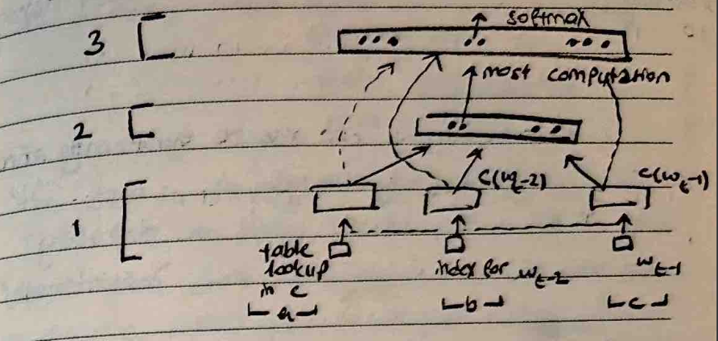
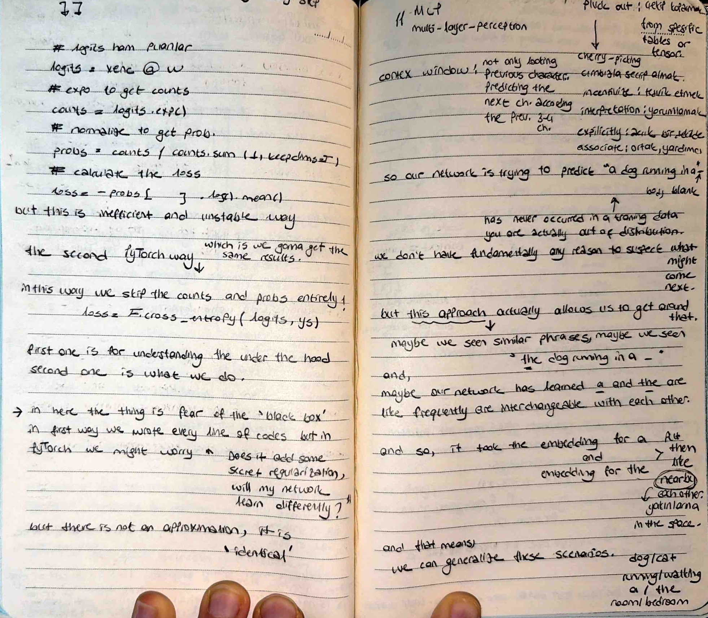
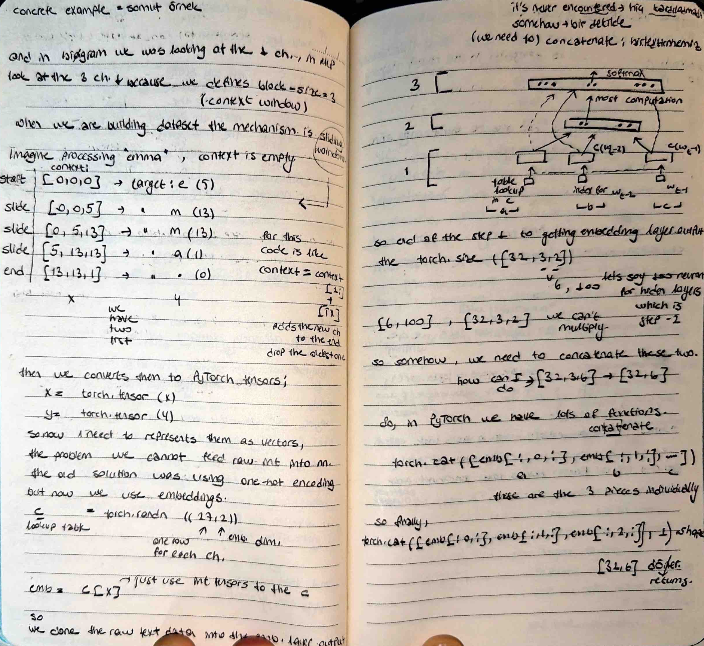

# 🧠 From Bigrams to MLPs - The Context Window

I am evolving my architecture from a simple $27 \times 27$ counting matrix to a **Multi-Layer Perceptron (MLP)**. Today’s breakthrough was moving from single-character statistics to a **Sliding Context Window**.
## 📸 My Notes
My notes today detail the sliding window example for "emma" and the logic behind the embedding lookup table.

## 🚀 Sliding Window Mechanism
Instead of predicting the next character based on just one previous character, I implemented a **block_size** of 3. 
- **The Concept:** I look at a window of 3 tokens. As the model processes text (like the name "emma"), the window slides forward, dropping the oldest character and adding the newest one.
- **The Pay-off:** This allows the network to capture much more complex linguistic patterns.

## ⚡ Embeddings vs. One-Hot Encoding
I replaced my previous One-Hot encoding method with a more efficient **Embedding Lookup Table (C)**:
- **Storage:** Instead of massive, sparse 27-dimensional vectors, I now represent each character in a compact 2-dimensional space ($C \in \mathbb{R}^{27 \times 2}$).
- **Index Plucking:** Using PyTorch, I can simply use `C[X]` to retrieve the relevant vectors from memory, which is significantly faster and more "numerically well-behaved".

## 📂 The Concatenation Challenge
I documented how to handle the input shapes for the hidden layer. Since my embedding layer returns a shape like `[Batch, 3, 2]`, I must **concatenate** those characters into a single vector of size 6 to be compatible with my weight matrix ($W_1$).
