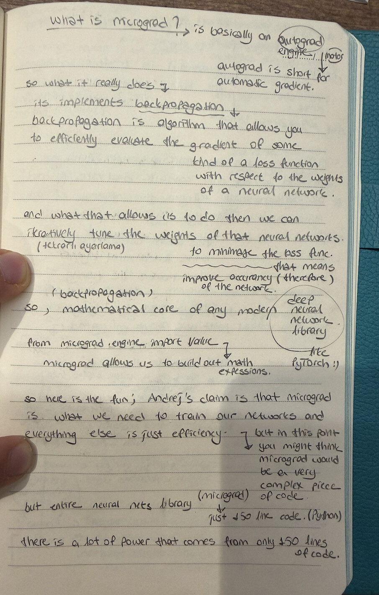

# My Neural Networks Projects

<p align="center">
  
</p>

<p align="center"><i>Every concept handwritten first. Then implemented.</i></p>

---

A one-year, day-by-day study log of neural network internals — from a scalar autograd engine to character-level RNNs.

The work is documented through handwritten notes. Code supports the notes, not the other way around.

---

## What it is

This repository is a running implementation log. Each day covers one concept from the mathematical foundations of deep learning, explained in handwritten notes and backed by working Python code.

The path follows the architecture of modern language models: how a gradient flows, how a loss is minimized, how a model learns to generate text.

The main reference is Andrej Karpathy's lecture series on neural networks and language models.

---

## Why handwritten notes

In an era of AI-generated content, the handwritten notes are the signal. They show the actual reasoning process — where understanding broke down, where it clicked, what needed to be drawn to become clear.

The notes are not summaries of what I read. They are the place where I worked through the problem.

---

## Learning map

| Day | Topic | Core concept |
|-----|-------|-------------|
| General | Autograd Engine & Backpropagation | Scalar `Value` class, computation graph, chain rule |
| 2 | Neural Network Core | Neuron → Layer → MLP from scratch |
| 3 | Training Loop | Forward pass, loss, `.backward()`, parameter update |
| 4 | Modularization & Gradient Descent | Automated parameter collection, full GD loop |
| 5 | Bigram Language Model | Character-level NLP, frequency counting, probabilistic sampling |
| 6 | Broadcasting & Vectorized Evaluation | Eliminating Python loops, tensor broadcasting rules |
| 7 | One-Hot Encoding | Why raw integers bias the model, the identity principle |
| 8 | Softmax & Numerical Stability | Log-Sum-Exp trick, NLL loss, production-level loss functions |
| 9 | MLP & Sliding Context Window | Embedding lookup table, block size, concatenation challenge |
| 10 | ML Best Practices | Train / val / test split, diagnosing underfitting |
| 11 | Weight Initialization | Dead tanh problem, why bad init destroys learning |
| 12 | Manual Backpropagation | Courier analogy, gradient flow through each op by hand |
| 13 | Kaiming Initialization | Fan-in scaling, calibrating signal variance |
| 14 | Batch Normalization | 2015 Google innovation, internal covariate shift |
| 15 | Residual Networks | Skip connections, vanishing gradient solution |
| 16 | Diagnostic Dashboard | Activation histograms, gradient flow visualization |
| 17 | Character-Level RNN | Hidden state, recurrence equation, text generation |
| 19 | Extended implementations | Additional architectural experiments |

---

## Stack

| Layer | Technology |
|-------|-----------|
| Language | Python 3 |
| Framework | PyTorch |
| Environment | Jupyter / plain Python scripts |
| Dataset | Karpathy's `names.txt` (character-level) |

---

## Repo structure

```
My-Neural-Networks-Projects/
├── neural_networks_general/   autograd foundation (micrograd-style)
├── neural_networks_day2/      neural network core
├── neural_networks_day3/      training loop
├── ...
├── neural_networks_day17/     character-level RNN
├── neural_networks_day19/     extended experiments
└── notes/                     root handwritten notes (Day 1)
```

Each day folder contains:
```
neural_networks_dayN/
├── README.md     handwritten notes (images) + concept breakdown
├── notes/        scanned handwritten pages
└── *.py          supporting implementation
```

---

## Status

| Phase | Coverage | Status |
|-------|----------|--------|
| Autograd & backprop | Days General–4 | complete |
| Language modeling foundations | Days 5–9 | complete |
| Training best practices | Days 10–13 | complete |
| Modern architectures (BatchNorm, ResNet) | Days 14–15 | complete |
| Diagnostics & debugging | Day 16 | complete |
| Recurrent networks | Days 17–19 | in progress |
| Transformer architecture | — | planned |

---

**Ahmet Selim Fedakar** · Software Engineering · Los Angeles
